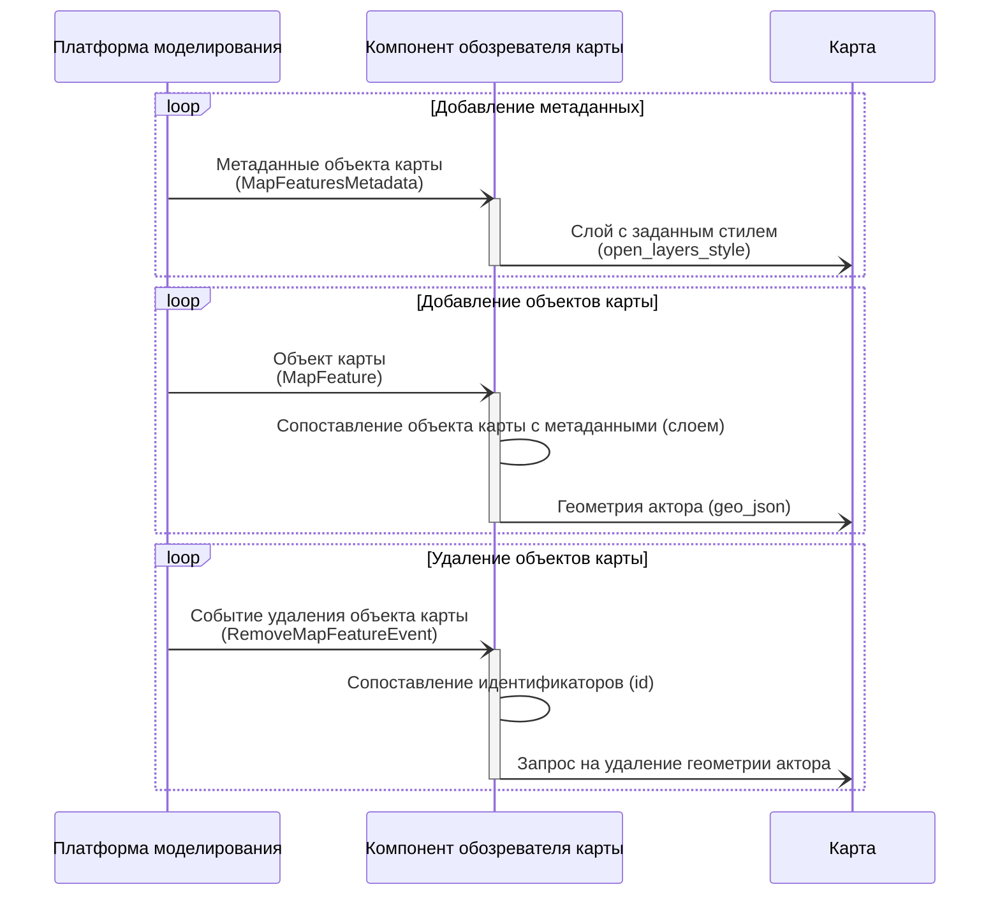
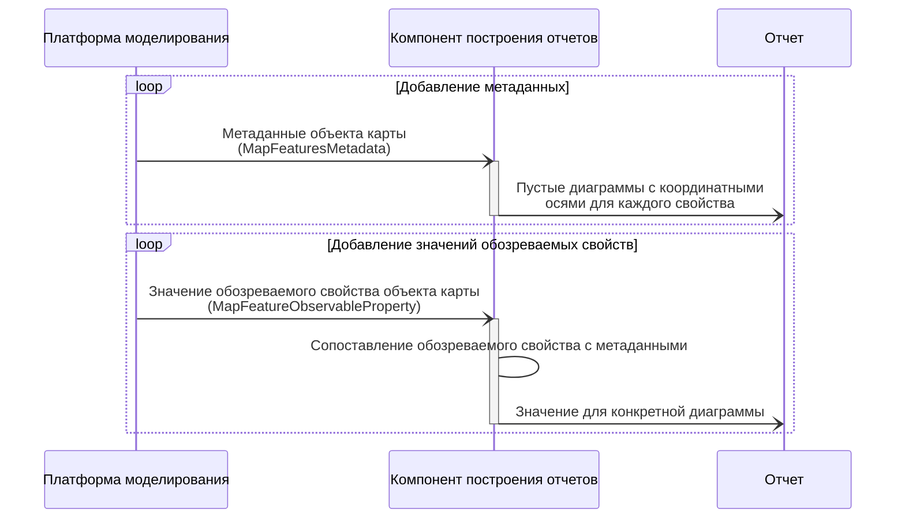

```puml
skinparam monochrome true
skinparam shadowing false
left to right direction

Пользователь --> (Принятие решения на основе моделирования)
(Принятие решения на основе моделирования) ..> (Просмотр свойств модели и акторов) : <<include>>
(Просмотр графических отчетов на основе свойств) ..> (Просмотр свойств модели и акторов) : <<extend>>

(Конфигурирование модели) ..> (Принятие решения на основе моделирования) : <<extend>>
(Конфигурирование модели) ..> (Добавление сборок) : <<include>>
(Конфигурирование модели) ..> (Выбор модулей, участвующих в моделировании) : <<include>>
(Конфигурирование модели) ..> (Управление жизненным циклом моделирования) : <<include>>
(Конфигурирование модели) ..> (Изменение свойст модели и акторов) : <<include>>
```

## Отображение карты и акторов

Диаграмма последовательности для компонента обозревателя карты



## Работа со свойствами объектов карты

Диаграмма последовательности для компонента свойств карты

```mermaid
sequenceDiagram
    participant Backend as Платформа моделирования
    participant PropertiesComponent as Компонент построения отчетов
    participant Properties as Таблицы свойств

    loop Добавление метаданных
        Backend -) PropertiesComponent: Метаданные объекта карты<br/>(MapFeaturesMetadata)
        activate PropertiesComponent

        PropertiesComponent -) Properties: Пустые таблицы с известными<br/>названиями и типами колонок

        deactivate PropertiesComponent
    end

    loop Добавление значений обозреваемых свойств
        Backend -) PropertiesComponent: Значение обозреваемого свойства объекта карты<br/>(MapFeatureObservableProperty)
        activate PropertiesComponent

        PropertiesComponent -> PropertiesComponent: Сопоставление обозреваемого свойства с метаданными
        PropertiesComponent -) Properties: Значение для конкретной колонки и ячейки

        deactivate PropertiesComponent
    end
    
    loop Изменение значений обозреваемых свойств
        Properties -) PropertiesComponent: Изменение значения в ячейке
        activate PropertiesComponent
        PropertiesComponent -) Backend: Значение обозреваемого свойства объекта карты<br/>(MapFeatureObservableProperty)
        activate Backend

        deactivate PropertiesComponent
        Backend -> Backend: Обновление значения свойства

        deactivate Backend
    end
    
    loop Удаление объектов карты
        Backend -) PropertiesComponent: Событие удаления объекта карты<br/>(RemoveMapFeatureEvent)
        activate PropertiesComponent
        
        PropertiesComponent -> PropertiesComponent: Сопоставление идентификаторов (id)
        PropertiesComponent -) Properties: Запрос на удаление строки таблицы

        deactivate PropertiesComponent
    end
```

## Построение отчетов

Диаграмма последовательности для компонента построения отчетов


